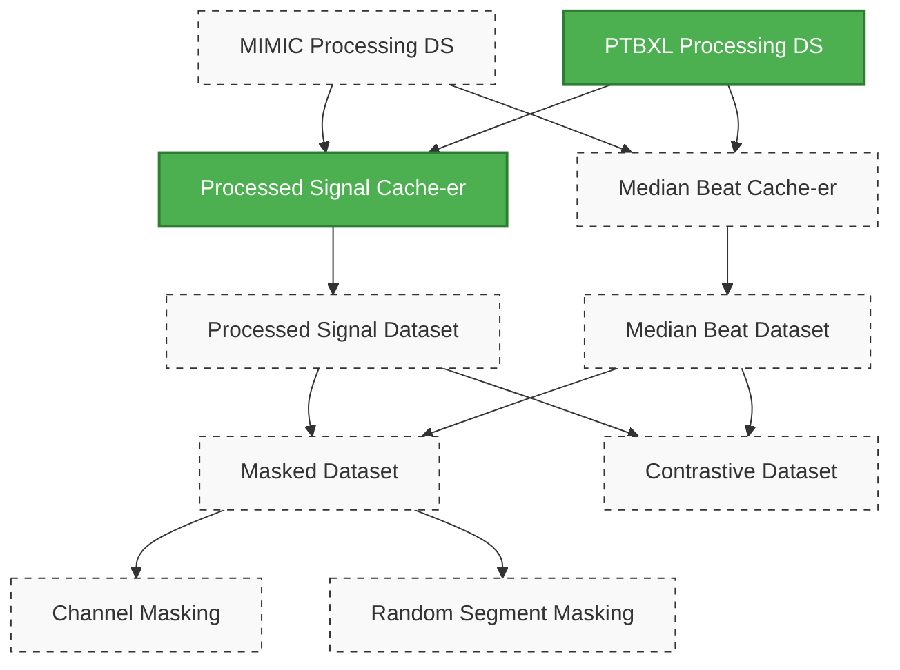

# Roadmap

```mermaid
graph TD
  %% Define Styles
  classDef complete fill:#4CAF50,stroke:#2E7D32,stroke-width:2px,color:#fff;
  classDef incomplete fill:#f9f9f9,stroke:#333,stroke-dasharray: 5 5;

  %% Nodes
  A[MIMIC Processing DS]:::incomplete
  B[PTBXL Processing DS]:::complete
  C[Processed Signal Cache-er]:::complete
  D[Processed Signal Dataset]:::incomplete
  E[Median Beat Cache-er]:::incomplete
  F[Median Beat Dataset]:::incomplete
  G[Masked Dataset]:::incomplete
  H[Channel Masking]:::incomplete
  I[Random Segment Masking]:::incomplete
  J[Contrastive Dataset]:::incomplete

  A --> C
  B --> C
  C --> D
  A --> E
  B --> E
  E --> F
  D --> G
  F --> G
  G --> H
  G --> I
  D --> J
  F --> J


```